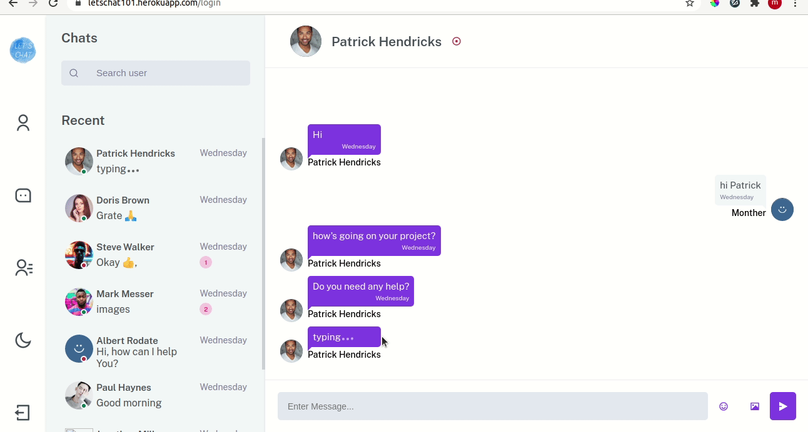

# letschat

letschat is a real time chat app build using ExpressJS an ReactJS.

### [Demo](https://monther-chat-app.herokuapp.com/)

### Installation

- clone the repo
- install packages for express -`npm install`
- install packages for react -`cd public` -`npm install`
- run the dev mode -`npm run start:dev`

### Features!

Like any simple chat app it allow user to chat with other users directly or in groups

### Tech

letschat uses a number of open source projects to work properly:

- [Express](https://expressjs.com/) - Web framework for Node.js
- [React](https://reactjs.org/) - JavaScript library for building user interfaces
- [socket-io](https://socket.io/) - real-time sockets
